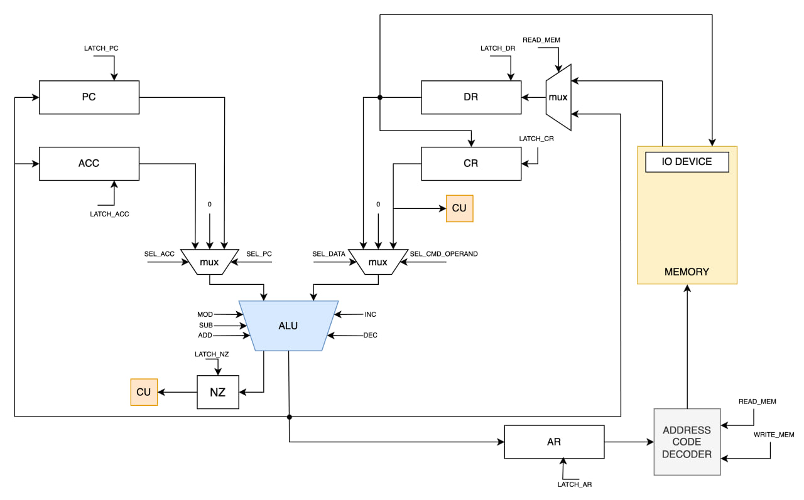

# CPU Model

| Особенности | |
|-|-|
| ЯП. Синтаксис           | Синтаксис ассемблера. Поддержка меток (labels).                     |
| Архитектура             | Cистема команд выстроена вокруг аккумулятора. Инструкции -- изменяют значение, хранимое в аккумуляторе. Ввод-вывод осуществляется через аккумулятор.                 |
| Организация памяти      | Архитектура фон Неймана.                                            |
| Control Unit            | Hardwired. Реализована как часть модели.                            |
| Точность модели         | Процессор моделируется с точностью до каждой инструкции.            |
| Представление маш. кода | Представление в виде высокоуровневой структуры данных.              |
| Ввод-вывод              | Ввод-вывод осуществляется как поток токенов.                        |
| Ввод-вывод ISA          | Memory-mapped -- порты ввода-вывода отображаются в память и доступ к ним осуществляется штатными командами |
| Тип строк               | Pascal string (Length-prefixed) |

## Язык программирования

### Форма Бэкуса-Наура

```ebnf
<program> ::= lines

<lines> ::= line | line new_line program

<line> ::= statement | label | comment

<label> ::= <any string except: ";">":" | start_label

<start_label> ::= "_start:" new_line

<comment> ::= ";" string

<statement> ::= mnemonic | mnemonic arg | mnemonic comment | mnemonic arg comment

<mnemonic> ::= org
           | word
           | int
           | ld
           | st
           | add
           | sub
           | inc
           | dec
           | cmp
           | jmp
           | jz
           | nop
           | hlt

<arg> ::= integer
        | "#"integer
        | "$"integer
        | label
        | "&"label
        | "$"label
        | string

<string> ::= "char" | "<char><string>"
<integer> ::= digit | <digit><integer>
<digit> ::= 0 | 1 | 2 | ... | 8 | 9
```

- Код выполняется последовательно.
- Видимость меток и данных -- глобальная
- Для записи литералов используются `word` и `int`.

### Операции
- `org` - разместить код начиная с определенного адреса
- `word` - разместить строку в памяти (один символ - одна ячейка)
- `int` - разместить число в памяти
- `ld` - загрузить значение по адресу в аккумулятор
- `st` - записать значение из аккумулятора по адресу
- `add` - суммировать значение аргумента и аккумулятора (_acc + arg_)
- `sub` - вычесть значение аргумента из аккумулятора (_acc - arg_)
- `mod` - вычислить остаток от деления аккумулятора на значение аргумента (_acc % arg_)
- `inc` - увеличить значение аккумулятора на единицу
- `dec` - уменьшить значение аккумулятора на единицу
- `cmp` - сравнить значение аккумулятора с значением аргумента
- `jmp` - выполнить безусловный переход по адресу
- `jz` - выполнить переходе, если Z == 1
- `nop` - ипользуется для резервирования памяти
- `hlt` - остановить выполнение


## Организация памяти
- Фон-Неймановская архитектура – общая память для инструкций и данных
- Память содержит 1024 ячеек
- Размер машинного слова не определён
- Реализуется списком словарей
- Выполнение программы начинается с метки `_start`
- В нулевой ячейке находится `jmp` на метку `_start`
- Для команд ввода/вывода используется ячейка с адремом `0x1`
- Программист имеет доступ к регистру `ACC` (аккумулятор)

```
Регистры
+------------------------+
| ACC - аккумулятор      |
+------------------------+
| PC - счётчик команд    |
+------------------------+
| DR - регистр данных    |
+------------------------+
| CR - регистр команд    |
+------------------------+
| AR - регистр адреса    |
+------------------------+
| NZ - регистр состояния |
+------------------------+

Память данных и команд
+---------------------+
| 0      : jmp _start |
| 1      : I/O        |
|       ...           |
| n+0    : literal 1  |  <-- Хранит длину литерала, если он является строкой
| n+1    : literal 1  |  <-- Далее -- символы по порядку (один символ -- одна ячейка)
| n+2    : literal 1  |
|       ...           |
| k      : literal 2  |
|       ...           |
| _start : prog start |
|       ...           |
+---------------------+
```

### Адресация
- `69` - указывает на значение ячейки по адресу `69`
- `#69` - прямая загрузка операнда
- `label` - указывает на значение ячейки по адресу метки `label`
- `&label` - указывает на адрес метки `label`
- `$69` - указывает на значение ячейки, которая находится по адресу, находящемуся по адресу `69`

## Система команд
### Набор инструкций
| Мнемоника | Кол-во тактов | Описание |
|-|-|-|
|add `<arg>`| 2-6 | `acc + arg -> acc, nz` |
|sub  `<arg>`| 2-6 | `acc - arg -> acc, nz` |
|inc| 1 | `acc + 1 -> acc, nz` |
|dec| 1 | `acc - 1 -> acc, nz` |
|ld `<arg>`| 2-6 | `mem[arg] -> acc, nz` |
|st `<arg>`| 4-8 | `acc -> mem[arg]` |
|cmp `<arg>`| 2-6 | `acc - arg -> nz` |
|mod `<arg>`| 2-6| `acc % arg -> acc, nz` |
|jmp `<addr>`| 2-6| Выполнить безусловный переход по адресу `<addr>` |
|jz `<addr>`| 2-6 |Выполнить переход по адресу `<addr>`, если Z == 1 |
|hlt| 1 | Останвить выполнение |
|nop|-|Отсутсвие операции (Используется для размещения литералов в памяти)|
|word `<str>`| - | Записать в память строку `<str>` (один символ - одна ячейка)|
|int `<int>`| - | Записать в память число `<int>` |
|org `<addr>`| - | Разместить след. блок кода начиная с адреса `<addr>` |

Где:
- `acc` - аккумулятор
- `nz` - флаги состояния (Negative, Zero)
- `mem[arg]` - значение ячейки памяти по адресу `arg`

> Мнемоники `int` и `word` не являются инструкциями, а используются для записи данных в память.

### Кодирование инструкций
- Инструкции хранятся в формате JSON
- Один элемент списка -- одна инструкция.

Пример:
```json
{
  "index": 13,
  "opcode": "st",
  "arg": 6,
  "arg_type": "raw"
}
```
Где:
- `index` - адрес инструкции в памяти
- `opcode` - код операции
- `arg` - операнд
- `arg_type` - тип аргумента

## Транслятор
Интерфейс командной строки: `translator.py <input_file> <target_file>`

Реализовано в модуле: [translator](src/translator.py)

Этапы трансляции:
- Выделение меток из кода, проверка их корректности (не совпадают с названиями команд, отсуствуют дубликаты)
- Парсинг кода построчно (определение инструкции, её адреса, тип адресации.)
- Замена `word` и `int` на соответсвующие `nop` операции
- Генерация машинного кода
- Подстановка меток в соответсвующие машинные инструкции

Метки в машинном коде, __не сохраняются__ . Метки, использованные в качестве операнда, преобразуются к адресам команд

## Модель процессора
Интерфейс командной строки: `machine.py <code> <input>`

Реализовано в модуле: [machine](src/machine.py)

### DataPath


Реализован в классе DataPath в модуле [data_path](src/data_path.py)

`Address Code Decoder` определяет к какому устройству мы обращаемся (память или ВУ)

#### Сигналы DataPath
- `latch_pc` - защёлкнуть PC
- `latch_acc` - защёлкнуть ACC
- `latch_dr` - защёлкнуть DR
- `latch_cr` - защёлкнуть CR
- `latch_ar` - защёлкнуть AR
- `latch_nz` - защёлкнуть флаги NZ
- `sel_acc` - подать ACC на левый вход АЛУ
- `sel_pc` - подать PC на левый вход АЛУ
- `sel_data` - подать DR на правый вход АЛУ
- `sel_cmd_opernad` - подать операнд на правый вход АЛУ
- `read_mem` - считать из памяти по адресу AR
- `write_mem` - записать в память по адрему AR
- `mod` - вычислить остаток от деления
- `sub` - вычислить разность
- `add` - вычислить сумму
- `inc` - инкрементировать значение
- `dec` - декрементирвать значение

### ControlUnit


Реализован в классе ControlUnit в модуле [control_unit](src/control_unit.py)

#### Особенности работы модели
- Hardwired
- `step counter` необходим для многотактовых инструкций
- Цикл симуляции осуществляется в функции `run`.
- Шаг моделирования соответствует одной инструкции с выводом состояния в журнал.
- Для журнала состояний процессора используется стандартный модуль logging.
- Остановка моделирования осуществляется при:
- - исключении ValueError (были переданы некорректные данные)
- - исключении SystemExit (выполнена инструкция halt)
- - исключении BufferError (буфер переполнен или пустой)

## Тестирование
Тестирование выполняется при помощи golden test-ов.

GitLab CI:
```yml
stages:
  - test
  - lint

test-lab3:
  stage: test
  image:
    name: ryukzak/python-tools
    entrypoint: [""]
  script:
    - python3 -m pip install --upgrade pip
    - pip install -r requirements.txt
    - coverage run -m poetry run pytest . -v --update-goldens
    - coverage report -m

lint-lab3:
  stage: lint
  image:
    name: ryukzak/python-tools
    entrypoint: [""]
  script:
    - python3 -m pip install --upgrade pip
    - pip install -r requirements.txt
    - ruff format --check .
    - ruff check .
```

Пример использования и журнал работы процессора на примере `cat`:
```bash
$ cat example/input.txt
Lorem ipsum ?

$ cat example/cat.asm
org 5
counter:
    int 0
_start:
    ld 1
    st &counter
    loop:
        ld 1
        st #1
        ld counter
        dec
        st &counter
        jz stop
        jmp loop
    stop:
        hlt

$ python3 src/translator.py example/cat.asm out/cat.json
$ cat out/cat.json
[
  {"index": 0, "opcode": "jmp", "arg": "6", "arg_type": "default"},
  {"index": 6, "opcode": "ld", "arg": "1", "arg_type": "default"},
  {"index": 7, "opcode": "st", "arg": "1", "arg_type": "raw"},
  {"index": 8, "opcode": "jmp", "arg": 6, "arg_type": "default"}
]

$ python3 src/machine.py out/cat.json example/input.txt
DEBUG | TICK: 4    | jmp  | ARG: 6   | TYPE: default | PC: 6   | ACC: 0   | DR: 6   | AR: 0   | N: False  | Z: False
INFO | IN: 76
DEBUG | TICK: 10   | ld   | ARG: 1   | TYPE: default | PC: 7   | ACC: 76  | DR: 76  | AR: 1   | N: False  | Z: False
INFO | OUT: 76
DEBUG | TICK: 17   | st   | ARG: 1   | TYPE: raw     | PC: 8   | ACC: 76  | DR: 76  | AR: 1   | N: False  | Z: False
DEBUG | TICK: 21   | jmp  | ARG: 6   | TYPE: default | PC: 6   | ACC: 76  | DR: 6   | AR: 8   | N: False  | Z: False
INFO | IN: 111
DEBUG | TICK: 27   | ld   | ARG: 1   | TYPE: default | PC: 7   | ACC: 111 | DR: 111 | AR: 1   | N: False  | Z: False
INFO | OUT: 111
DEBUG | TICK: 34   | st   | ARG: 1   | TYPE: raw     | PC: 8   | ACC: 111 | DR: 111 | AR: 1   | N: False  | Z: False
DEBUG | TICK: 38   | jmp  | ARG: 6   | TYPE: default | PC: 6   | ACC: 111 | DR: 6   | AR: 8   | N: False  | Z: False
INFO | IN: 114
DEBUG | TICK: 44   | ld   | ARG: 1   | TYPE: default | PC: 7   | ACC: 114 | DR: 114 | AR: 1   | N: False  | Z: False
INFO | OUT: 114
DEBUG | TICK: 51   | st   | ARG: 1   | TYPE: raw     | PC: 8   | ACC: 114 | DR: 114 | AR: 1   | N: False  | Z: False
DEBUG | TICK: 55   | jmp  | ARG: 6   | TYPE: default | PC: 6   | ACC: 114 | DR: 6   | AR: 8   | N: False  | Z: False
INFO | IN: 101
DEBUG | TICK: 61   | ld   | ARG: 1   | TYPE: default | PC: 7   | ACC: 101 | DR: 101 | AR: 1   | N: False  | Z: False
INFO | OUT: 101
DEBUG | TICK: 68   | st   | ARG: 1   | TYPE: raw     | PC: 8   | ACC: 101 | DR: 101 | AR: 1   | N: False  | Z: False
DEBUG | TICK: 72   | jmp  | ARG: 6   | TYPE: default | PC: 6   | ACC: 101 | DR: 6   | AR: 8   | N: False  | Z: False
INFO | IN: 109
DEBUG | TICK: 78   | ld   | ARG: 1   | TYPE: default | PC: 7   | ACC: 109 | DR: 109 | AR: 1   | N: False  | Z: False
INFO | OUT: 109
DEBUG | TICK: 85   | st   | ARG: 1   | TYPE: raw     | PC: 8   | ACC: 109 | DR: 109 | AR: 1   | N: False  | Z: False
DEBUG | TICK: 89   | jmp  | ARG: 6   | TYPE: default | PC: 6   | ACC: 109 | DR: 6   | AR: 8   | N: False  | Z: False
INFO | IN: 32
DEBUG | TICK: 95   | ld   | ARG: 1   | TYPE: default | PC: 7   | ACC: 32  | DR: 32  | AR: 1   | N: False  | Z: False
INFO | OUT: 32
DEBUG | TICK: 102  | st   | ARG: 1   | TYPE: raw     | PC: 8   | ACC: 32  | DR: 32  | AR: 1   | N: False  | Z: False
DEBUG | TICK: 106  | jmp  | ARG: 6   | TYPE: default | PC: 6   | ACC: 32  | DR: 6   | AR: 8   | N: False  | Z: False
INFO | IN: 105
DEBUG | TICK: 112  | ld   | ARG: 1   | TYPE: default | PC: 7   | ACC: 105 | DR: 105 | AR: 1   | N: False  | Z: False
INFO | OUT: 105
DEBUG | TICK: 119  | st   | ARG: 1   | TYPE: raw     | PC: 8   | ACC: 105 | DR: 105 | AR: 1   | N: False  | Z: False
DEBUG | TICK: 123  | jmp  | ARG: 6   | TYPE: default | PC: 6   | ACC: 105 | DR: 6   | AR: 8   | N: False  | Z: False
INFO | IN: 112
DEBUG | TICK: 129  | ld   | ARG: 1   | TYPE: default | PC: 7   | ACC: 112 | DR: 112 | AR: 1   | N: False  | Z: False
INFO | OUT: 112
DEBUG | TICK: 136  | st   | ARG: 1   | TYPE: raw     | PC: 8   | ACC: 112 | DR: 112 | AR: 1   | N: False  | Z: False
DEBUG | TICK: 140  | jmp  | ARG: 6   | TYPE: default | PC: 6   | ACC: 112 | DR: 6   | AR: 8   | N: False  | Z: False
INFO | IN: 115
DEBUG | TICK: 146  | ld   | ARG: 1   | TYPE: default | PC: 7   | ACC: 115 | DR: 115 | AR: 1   | N: False  | Z: False
INFO | OUT: 115
DEBUG | TICK: 153  | st   | ARG: 1   | TYPE: raw     | PC: 8   | ACC: 115 | DR: 115 | AR: 1   | N: False  | Z: False
DEBUG | TICK: 157  | jmp  | ARG: 6   | TYPE: default | PC: 6   | ACC: 115 | DR: 6   | AR: 8   | N: False  | Z: False
INFO | IN: 117
DEBUG | TICK: 163  | ld   | ARG: 1   | TYPE: default | PC: 7   | ACC: 117 | DR: 117 | AR: 1   | N: False  | Z: False
INFO | OUT: 117
DEBUG | TICK: 170  | st   | ARG: 1   | TYPE: raw     | PC: 8   | ACC: 117 | DR: 117 | AR: 1   | N: False  | Z: False
DEBUG | TICK: 174  | jmp  | ARG: 6   | TYPE: default | PC: 6   | ACC: 117 | DR: 6   | AR: 8   | N: False  | Z: False
INFO | IN: 109
DEBUG | TICK: 180  | ld   | ARG: 1   | TYPE: default | PC: 7   | ACC: 109 | DR: 109 | AR: 1   | N: False  | Z: False
INFO | OUT: 109
DEBUG | TICK: 187  | st   | ARG: 1   | TYPE: raw     | PC: 8   | ACC: 109 | DR: 109 | AR: 1   | N: False  | Z: False
DEBUG | TICK: 191  | jmp  | ARG: 6   | TYPE: default | PC: 6   | ACC: 109 | DR: 6   | AR: 8   | N: False  | Z: False
INFO | IN: 32
DEBUG | TICK: 197  | ld   | ARG: 1   | TYPE: default | PC: 7   | ACC: 32  | DR: 32  | AR: 1   | N: False  | Z: False
INFO | OUT: 32
DEBUG | TICK: 204  | st   | ARG: 1   | TYPE: raw     | PC: 8   | ACC: 32  | DR: 32  | AR: 1   | N: False  | Z: False
DEBUG | TICK: 208  | jmp  | ARG: 6   | TYPE: default | PC: 6   | ACC: 32  | DR: 6   | AR: 8   | N: False  | Z: False
INFO | IN: 63
DEBUG | TICK: 214  | ld   | ARG: 1   | TYPE: default | PC: 7   | ACC: 63  | DR: 63  | AR: 1   | N: False  | Z: False
INFO | OUT: 63
DEBUG | TICK: 221  | st   | ARG: 1   | TYPE: raw     | PC: 8   | ACC: 63  | DR: 63  | AR: 1   | N: False  | Z: False
DEBUG | TICK: 225  | jmp  | ARG: 6   | TYPE: default | PC: 6   | ACC: 63  | DR: 6   | AR: 8   | N: False  | Z: False
Input buffer is empty!
Terminating...
```

Пример проверки исходного кода:
```bash
$ poetry run coverage run -m poetry run pytest . -v --update-goldens
===================================================================== test session starts =====================================================================
platform darwin -- Python 3.12.3, pytest-8.2.2, pluggy-1.5.0 -- /Users/ilya/Desktop/ITMO/АК/csa-lab3/venv/bin/python3.12
cachedir: .pytest_cache
rootdir: /Users/ilya/Desktop/ITMO/АК/csa-lab3
configfile: pyproject.toml
plugins: golden-0.2.2
collected 4 items

src/golden_test.py::test_cpu[../golden/prob1.yml] PASSED                                                                                                [ 25%]
src/golden_test.py::test_cpu[../golden/cat.yml] PASSED                                                                                                  [ 50%]
src/golden_test.py::test_cpu[../golden/hello_user.yml] PASSED                                                                                           [ 75%]
src/golden_test.py::test_cpu[../golden/hello_world.yml] PASSED                                                                                          [100%]

====================================================================== 4 passed in 1.49s ======================================================================

$ ruff format --check .
9 files already formatted

$ ruff check .
All checks passed!
```


```
| алг   | LoC | code инстр. | инстр. | такт  |
| hello | 25  | 19          | 135    | 770   |
| cat   | 8   | 12          | 40     | 225   |
| prob1 | 31  | 23          | 12860  | 65767 |
```
